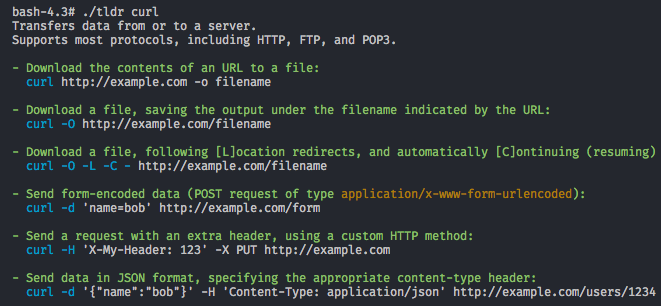

# tldr-php
[](https://travis-ci.org/BrainMaestro/tldr-php)
[](https://packagist.org/packages/brainmaestro/tldr-php)
> A `PHP` based command-line client for [tldr](https://github.com/tldr-pages/tldr).



## Installing
```sh
composer global install brainmaestro/tldr
```

## Notes
- Tldr pages are cache in `$HOME/.tldr`.

## License
MIT © Ezinwa Okpoechi
